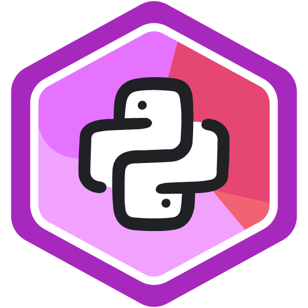
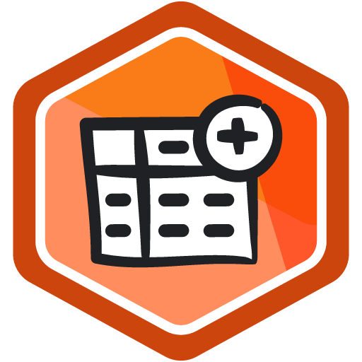
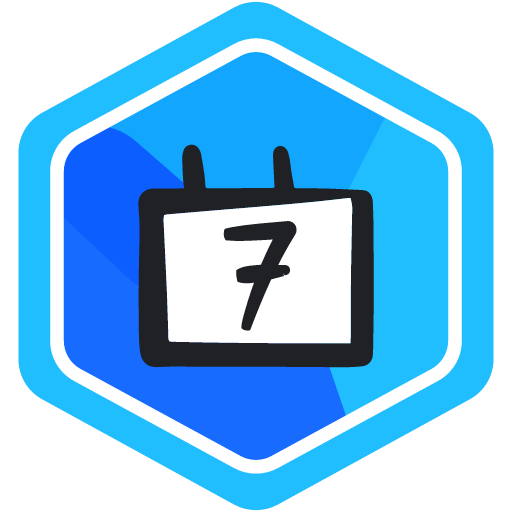

<div align="center">


# *“Designer who codes. Engineer who designs.”*

**Full-Stack Product & UI/UX Engineer**

Final-year ECE Engineer in Kolkata, building digital products across interface design, full-stack systems, computer vision, and applied AI.

<br/>

[](https://rups.framer.website/)
&nbsp;
[](https://www.linkedin.com/in/rupayan-uiux)
&nbsp;
[](https://github.com/Rupayan147)
&nbsp;
[](https://www.kaggle.com/rupayanbiswas)
&nbsp;
[](mailto:rupsbiswas147@gmail.com)

<br/>

```txt
┌─────────────────────────────────────────────────────────────────────────────────────────┐
│  CORE IDENTITY: Full-Stack Product Engineer  •  UI/UX Designer  •  AI Technologist       │
│  DIFFERENTIATOR: I don't stop at designing an interface. I build the system behind it.  │
└─────────────────────────────────────────────────────────────────────────────────────────┘
```

</div>

---

## ⚡ WHAT I ACTUALLY BUILD

I operate at the intersection of visual ergonomics and systems engineering—bridging high-fidelity UI design with robust backend APIs, local automation tools, and applied ML models.

```txt
┌──────────────┐     ┌────────────────┐     ┌──────────────┐     ┌──────────────┐     ┌──────────────┐
│  01. DESIGN  │ ──> │ 02. FRONTEND   │ ──> │ 03. BACKEND  │ ──> │ 04. AI / ML  │ ──> │  05. SHIP    │
│ Figma/Framer │     │ React & Expo   │     │ FastAPI/REST │     │ PyTorch/Tensor│    │ End-to-End   │
└──────────────┘     └────────────────┘     └──────────────┘     └──────────────┘     └──────────────┘
```

- **Product & UX Systems:** User journey mapping, typography hierarchy, design systems, conversion-focused UX.
- **Full-Stack & Mobile:** Type-safe frontend web applications, mobile client UX, RESTful API architecture, CLI dev tools.
- **AI & Applied ML:** Computer vision research, natural language processing tools, workflow automation.

---

## 🚀 FLAGSHIP PRODUCT CASE STUDY

<div align="center">
  <h2>U N I O N E</h2>
  <p><b>AI-assisted government benefits discovery and application guidance mobile platform.</b></p>
  <p><i>Simplifying complex public support programs into a clear, guided mobile journey.</i></p>
</div>

<br/>

```txt
┌─────────────────────────────────────────────────────────────────────────────────────────┐
│ THE CORE PROBLEM                                                                        │
│ Public assistance in the U.S. is fragmented across hundreds of federal, state, and      │
│ local portals. Citizens struggle to discover eligible programs, decipher complex rules, │
│ track paperwork, and know what step to take next.                                       │
└─────────────────────────────────────────────────────────────────────────────────────────┘
```

<div align="center">

### THE GUIDED PRODUCT EXPERIENCE
```txt
   DISCOVER           UNDERSTAND            APPLY               TRACK
┌──────────────┐     ┌──────────────┐     ┌──────────────┐     ┌──────────────┐
│ Personalized │ ──> │ Plain-text   │ ──> │ Required     │ ──> │ Application  │
│ Benefit Feed │     │ Eligibility  │     │ Documents    │     │ Status &     │
│ & Search     │     │ Explanations │     │ Checklist    │     │ Case Tracker │
└──────────────┘     └──────────────┘     └──────────────┘     └──────────────┘
```

</div>

<br/>

### 📱 Product Modules Built in Prototype

- **`Home Command Center`** — Personalized mobile dashboard surfacing urgent next steps, application alerts, and saved program highlights.
- **`Ask Unione`** — Conversational Q&A assistant guiding users through eligibility requirements in plain, accessible language.
- **`Discover & Filter`** — Benefit search engine with category filters, match percentage indicators, and official agency details.
- **`Benefit Detail Views`** — Comprehensive program breakdown outlining income threshold criteria, required verification documents, and official source links.
- **`Applications Tracker`** — Case management interface tracking submission milestones, active review stages, and pending user actions.
- **`Profile & Household Context`** — Household demographic, location, income, and family preference management driving personalized recommendations.

<br/>

### 🛣️ Prototype → Production Evolution Roadmap

| Phase | Technical Architecture & Implementation Scope |
| :--- | :--- |
| **Current Prototype** | Functional React Native & Expo mobile prototype built with **Expo Router**, **TypeScript**, **Tailwind CSS (NativeWind)**, and persistent local state (`AsyncStorage`). Uses mock benefit datasets and demo services to demonstrate the full end-to-end product UX. |
| **Production Evolution** | Planned integration of **RAG Knowledge Engine** (Vector DB + embeddings for official govt source retrieval), **ML Personalization** (eligibility ranking algorithms), **Government Open-Data Ingestion**, and **Secure Auth & Cloud Backend**. |

<br/>

<div align="center">

👉 **Explore Codebase & Architecture:** [`github.com/Rupayan147/Unione-APP`](https://github.com/Rupayan147/Unione-APP)

</div>

---

## 🛠️ SELECTED PROJECTS

<br/>

### `01` — UNIONE — AI Benefit Discovery Platform
> **AI-assisted mobile interface simplifying U.S. public benefit discovery and case tracking.**
- **Focus:** Replaces fragmented government website confusion with a guided mobile experience.
- **Stack:** `React Native` · `Expo Router` · `TypeScript` · `Tailwind CSS` · `Local State`
- **Repo:** [`Rupayan147/Unione-APP`](https://github.com/Rupayan147/Unione-APP)

---

### `02` — ChronoCode AI — Git History Storyteller
> **Developer CLI that turns raw Git commit logs into structured codebase evolution narratives.**
- **Focus:** Synthesizes commit metrics, author dynamics, and file churn into human-readable Markdown summaries via Gemini AI.
- **Stack:** `Python` · `Typer` · `Rich` · `GitPython` · `Gemini API`
- **Repo:** [`Rupayan147/ChronoCode-AI`](https://github.com/Rupayan147/ChronoCode-AI)

---

### `03` — UXRay Lite — Local Portfolio UX Auditor
> **Privacy-first, API-free web audit tool evaluating site visual hierarchy and recruiter-readiness.**
- **Focus:** Analyzes DOM structures locally for hero clarity, CTA placement, and visual balance without external cloud APIs.
- **Stack:** `FastAPI` · `Playwright` · `BeautifulSoup4` · `Pillow`
- **Repo:** [`Rupayan147/UXRay-Lite`](https://github.com/Rupayan147/UXRay-Lite)

---

### `04` — CropSense ML — Crop Diagnostic Dashboard
> **MobileNetV2 crop leaf disease classifier paired with an interactive React diagnostic dashboard.**
- **Focus:** Classifies rice leaf diseases from field images and surfaces actionable treatment protocols with visual confidence scores.
- **Stack:** `TensorFlow` · `MobileNetV2` · `FastAPI` · `React` · `Tailwind CSS`
- **Repo:** [`Rupayan147/CropSense-ML`](https://github.com/Rupayan147/CropSense-ML)

---

### `05` — PaperGrid — PDF Literature Survey Mapper
> **Full-stack research utility converting academic paper PDFs into structured survey tables.**
- **Focus:** Extracts research methodologies, limitations, and key findings from PDFs into exportable literature matrices.
- **Stack:** `React` · `FastAPI` · `PyMuPDF` · `SQLite` · `Pandas`
- **Repo:** [`Rupayan147/PaperGrid`](https://github.com/Rupayan147/PaperGrid)

---

## 🧠 ML & COMPUTER VISION RESEARCH

I conduct applied research and build tools combining deep learning, image restoration, and document intelligence:

- **Image & Video Dehazing Research:** Computer vision research investigating haze removal using FFA-Net architectures on the RESIDE dataset, benchmarked with PSNR and SSIM quantitative metrics.
  - **Stack:** `PyTorch` · `OpenCV` · `Python` · `PSNR/SSIM`
  - **Repo:** [`Rupayan147/Video_Dehazing`](https://github.com/Rupayan147/Video_Dehazing)
- **Crop Disease Transfer Learning:** Fine-tuned MobileNetV2 architecture for multi-class plant disease classification.
- **Natural Language Parsing & CLI Synthesis:** Gemini-backed structural story extraction from raw version control diffs.

---

## 🎨 UI/UX & PRODUCT DESIGN CASE STUDIES

Redesigns and interface systems focused on hierarchy, conversion, and visual ergonomics rather than superficial polish:

| Case Study | Focus & Domain | Highlights | Stack |
| :--- | :--- | :--- | :--- |
| **[FUTURE UX 01](https://github.com/Rupayan147/FUTURE_UX_01)** | Dental Platform Redesign | Layout hierarchy, trust UX, lead generation, and booking flows. | `Figma` · `Design System` |
| **[FUTURE UX 02](https://github.com/Rupayan147/FUTURE_UX_02)** | Visual System Exploration | Dark mode UI component library, typography scale, and dashboard layouts. | `UI Design` · `Framer` |
| **[FUTURE UX 03](https://github.com/Rupayan147/FUTURE_UX_03)** | Mobile Usability | Usability-first mobile redesign reducing onboarding friction. | `UX Research` · `Prototyping` |

### 🛠️ In Active Development
- **`PodPilot`** — Keyboard-driven Kubernetes terminal dashboard UI (`TypeScript` · `Ink` · `Bun`)
- **`MediSense`** — Mobile patient triage & diagnostic interface concept (`React Native` · `Expo` · `FastAPI`)

---

## 🔬 RESEARCH & ENGINEERING SYSTEMS

Highlighting tools built for workflow automation, research parsing, and local infrastructure:

- **Developer Tooling & CLI:** Built terminal interfaces with custom formatting and version control hooks (`ChronoCode AI`).
- **Research Literature Automation:** Parsed complex PDF layouts to extract methodology tables and limitations (`PaperGrid`).
- **Offline Inspection Engines:** Headless browser automation evaluating DOM accessibility and visual hierarchy (`UXRay Lite`).

---

## 🏅 KAGGLE CREDENTIALS & ACHIEVEMENTS

Platform achievements and badges verified from my official Kaggle profile ([`kaggle.com/rupayanbiswas`](https://www.kaggle.com/rupayanbiswas)):

<br/>

<div align="center">

<a href="https://www.kaggle.com/rupayanbiswas"></a>&nbsp;&nbsp;&nbsp;&nbsp;
<a href="https://www.kaggle.com/rupayanbiswas"></a>&nbsp;&nbsp;&nbsp;&nbsp;
<a href="https://www.kaggle.com/rupayanbiswas"></a>&nbsp;&nbsp;&nbsp;&nbsp;
<a href="https://www.kaggle.com/rupayanbiswas"></a>&nbsp;&nbsp;&nbsp;&nbsp;
<a href="https://www.kaggle.com/rupayanbiswas"></a>&nbsp;&nbsp;&nbsp;&nbsp;
<a href="https://www.kaggle.com/rupayanbiswas"></a>

<br/><br/>

| Badge Title | Achievement Domain | Asset Source |
| :--- | :--- | :---: |
| **Python Coder Badge** | Python Code Execution & Data Analysis | Official Kaggle Vector Asset |
| **Dataset Creator Badge** | ML Dataset Preparation & Publishing | Official Kaggle Vector Asset |
| **Kaggle Community Member** | Platform Participation & Discussions | Official Kaggle Vector Asset |
| **Bookmarker Badge** | ML Resource Curation | Official Kaggle Vector Asset |
| **Vampire Badge** | Platform Activity & Night Coding | Official Kaggle Vector Asset |
| **7 Day Login Streak** | Consistent ML Workflow & Platform Engagement | Official Kaggle Vector Asset |

<br/>

👉 **View Kaggle Profile:** [`kaggle.com/rupayanbiswas ↗`](https://www.kaggle.com/rupayanbiswas)

</div>

---

## 🧰 TECHNICAL TOOLBOX

<div align="center">

| DOMAIN | SKILLS & TECHNOLOGIES |
| :--- | :--- |
| **Product & UI/UX** | `Figma` · `Framer` · `Design Systems` · `Interaction Design` · `Information Architecture` · `Prototyping` |
| **Frontend & Mobile** | `React` · `React Native` · `TypeScript` · `Expo` · `Tailwind CSS` · `Vite` |
| **Backend & Databases** | `FastAPI` · `Python` · `RESTful APIs` · `SQLite` · `Supabase` |
| **AI, ML & Vision** | `TensorFlow` · `PyTorch` · `OpenCV` · `Computer Vision` · `RAG Architectures` · `MobileNetV2` |
| **Tools & Automation** | `Git` · `Docker` · `Playwright` · `CLI Tooling` · `PyMuPDF` · `Rich` |

</div>

---

## 🔁 HOW I BUILD PRODUCTS

```txt
┌────────────┐     ┌────────────┐     ┌────────────┐     ┌────────────┐
│ 01. IDEA   │ ──> │ 02.RESEARCH│ ──> │ 03. DESIGN │ ──> │ 04. BUILD  │
│ Isolate    │     │ Understand │     │ Map UX &   │     │ Engineer   │
│ Friction   │     │ Domain     │     │ Design System│   │ Interface  │
└────────────┘     └────────────┘     └────────────┘     └────────────┘
                                                                │
┌────────────┐     ┌────────────┐     ┌────────────┐            │
│ 07. SHIP   │ <── │ 06. TEST   │ <── │ 05. AI/DATA│ <────────────┘
│ Launch &   │     │ Validate   │     │ Connect    │
│ Refine     │     │ Workflows  │     │ APIs & ML  │
└────────────┘     └────────────┘     └────────────┘
```

1. **`01 — IDEA`** — Identify real human workflow bottlenecks in daily tools, public systems, or research.
2. **`02 — RESEARCH`** — Study domain rules, target user mental models, and technical constraints.
3. **`03 — DESIGN`** — Prototype high-fidelity UI systems, layout hierarchy, and micro-interactions in Figma/Framer.
4. **`04 — BUILD`** — Write clean, type-safe code for web, mobile client, or terminal interfaces.
5. **`05 — AI / DATA`** — Connect REST APIs, fine-tuned ML models, or document retrieval pipelines behind the screens.
6. **`06 — TEST`** — Validate visual contrast, failure modes, contrast ratios, and real user flows.
7. **`07 — SHIP`** — Release functional software tools that solve the original problem cleanly.

---

## 💭 MY PHILOSOPHY

> *"I don't want to build another demo.*  
> *I want to build something someone would actually use."*

```txt
┌────────────────┐     ┌──────────────┐     ┌───────────────────┐     ┌─────────────────────┐     ┌──────────┐
│ REAL PROBLEM   │  +  │  GOOD UX     │  +  │ SOLID ENGINEERING │  +  │ INTELLIGENT SYSTEMS │  =  │ PRODUCT  │
└────────────────┘     └──────────────┘     └───────────────────┘     └─────────────────────┘     └──────────┘
```

---

## 💼 CURRENT FOCUS & TARGET ROLES

I am actively seeking early-career opportunities, full-time roles, and internships in:

- **Product Design & UI/UX Engineering**
- **Frontend & Mobile Engineering (React / React Native)**
- **Product Engineering (Design + Full-Stack)**
- **AI/ML Product Development**
- **Freelance Design & Development**

---

## 📊 GITHUB SNAPSHOT

<div align="center">


&nbsp;


<br/><br/>


</div>

---

<div align="center">

### *Have a product worth building?*

### **[ LET'S TALK ↗ ](mailto:rupsbiswas147@gmail.com)**

<br/>

[](https://rups.framer.website/)
&nbsp;
[](https://www.linkedin.com/in/rupayan-uiux)
&nbsp;
[](https://www.kaggle.com/rupayanbiswas)
&nbsp;
[](mailto:rupsbiswas147@gmail.com)

<br/>


</div>
